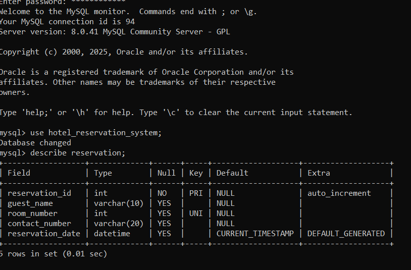
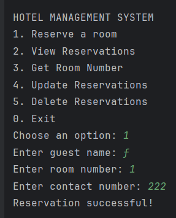
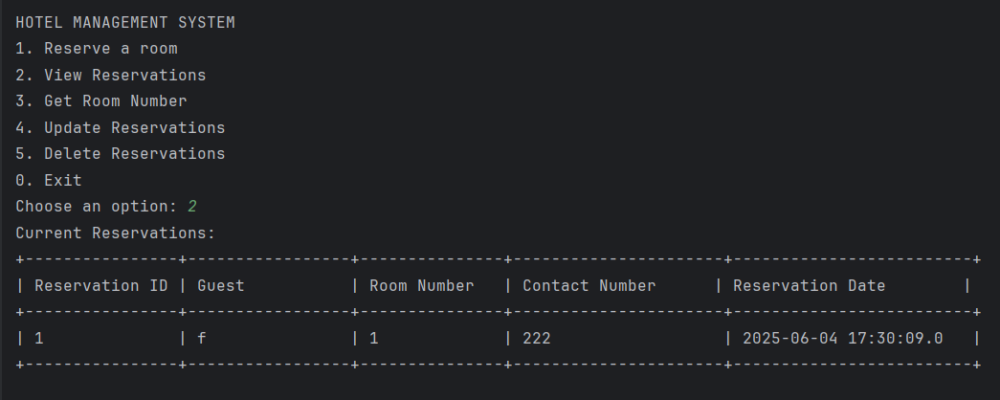
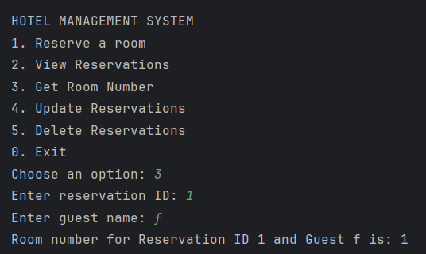
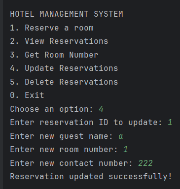
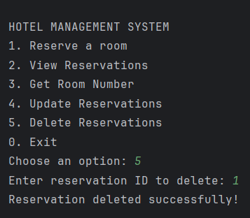
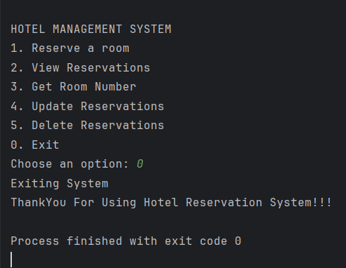

# Hotel Reservation System

A simple console-based **Hotel Reservation System** developed in Java using **JDBC** and **MySQL**. This project demonstrates basic CRUD operations, object-oriented principles, and backend integration using vanilla Java and SQL.

## 🛠 Technologies Used

- Java (OOP)
- JDBC (Java Database Connectivity)
- MySQL

## 📁 Database Structure

The project uses a MySQL database named `hotel_reservation_system`. It includes tables for managing hotel room reservations, customers, and availability.
> ⚠️ Make sure to create the database and necessary tables before running the program.

## ⚙️ Features

- Add a new reservation
- View all reservations
- Check room availability
- Cancel a reservation
- Exit system safely

## 📌 Prerequisites

- Java (JDK 8 or higher)
- MySQL Server
- MySQL JDBC Driver (Connector/J)

## 🚀 How to Run

1. **Clone the repository:**<br>

   ```bash
   git clone https://github.com/Fadeela76/hotel_reservation_system.git

2. **Set up your MySQL database:**<br>

Create the database hotel_reservation_system
Run the SQL script (if provided) or manually create tables as per the code requirements.

3. **Update DB credentials:**<br>

Open the Java file and update the url, username, and password in the following line:

java

private static final String url = "jdbc:mysql://localhost:3306/hotel_reservation_system";
private static final String username = "root";
private static final String password = "your_password";

4. **Compile and run the program:**<br>

bash

javac HotelReservationSystem.java
java HotelReservationSystem

🧠 Concepts Demonstrated
- JDBC CRUD operations (CREATE, READ, UPDATE and DELETE)
- Input validation using Scanner
- Exception handling
- Structured Java classes and methods

## SNAPSHOTS







